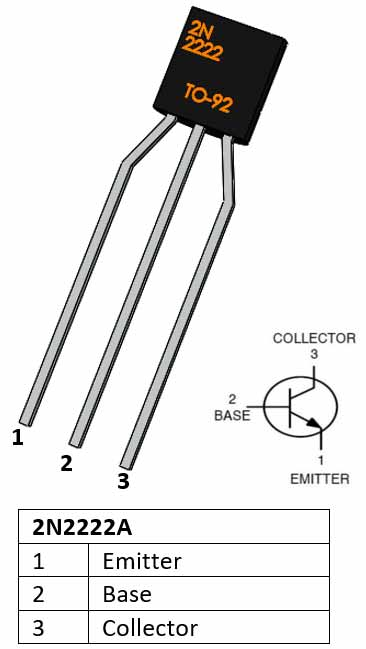
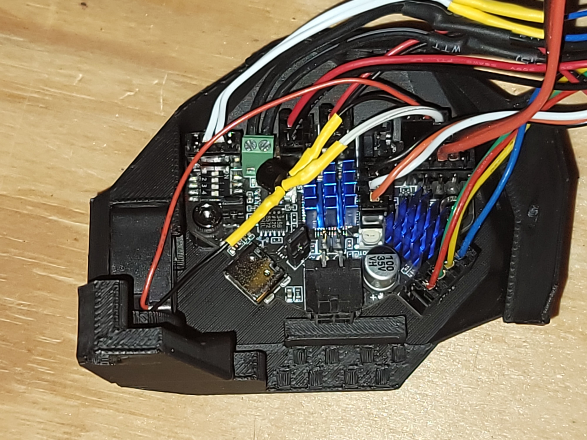

# EBB-Fan-Control
## Cooling Fan Control for EBB 36/42 CAN

**WARNING: You are about to read a guide written by a random dude on the internet.  I am not an electriction, infact I'm a computer programmer.  I'm not responsable if you burn your house down or if you destroy your personal property.  Follow this guide at your own risk.**


### This is a guide to show you how to control a 3rd fan from your EBB 36/42.  

BJTs are generaly low power devices that may be driven by microcontoller i/o pins.
The configuration I tested this is with, is the PB9 pin on the EBB 36 board. 
Per the schematic from BigTreeTech, PB9 has a 100 ohm resistor infront of it. 
The (B) base of the transisor should not be supplied more than 5 mA.
In order to supply 5 mA to the (B) base. we need a 900 ohm resistor. 100 + 900 = 1000. 5 V / 5 mA (0.005 A) = 1000 Ohm (1k Ohm)
The 900 ohm resistor is an ideal value.  You can use slightly less or more (less is perferable; as more will limit the current).  I am using an 820 ohm resistor.
If you use another pin, do so at your own risk, as not all the pins are configured the same.
The (B) base of the 2N2222A will draw considerably less power.

Due to the fact that the Sunon MF20100V1-1000U-A99 2010 Axial Fan is a Brushless DC fan; a diode for flyback should not be required; as diodes are used internally.

The BJT 2N2222A (NPN) Transistor is good for continuous current of up to 800mA.  The Sunon MF20100V1-1000U-A99 rated power consumption of 0.53 watts @ 106 mA (far below the power limit of the 2N2222A)

What you will need:

  * BJT 2N2222A (NPN) Transistor  
  * Sunon MF20100V1-1000U-A99 2010 Axial Fan  
  * 900 or slightly less ohm resistor  
  * Suitable wire and connectors  
  * Solder  
  * Heat shrink tubing  
  * Heat gun  


The connections are as folllows:
* Fan positive wire to +5v.
* Fan negitive wire to 2N2222A Collector.
* 2N2222A Emitter to GND.
* 2N2222A Base to the 900 Ohm Resistor.
* Other end of 900 Ohm Resistor to EBB36 pin PB9.

Here is my Klipper config for the fan:

```
[controller_fan canbus_fan]
pin: EBBCan:PB9
max_power: 1.0
shutdown_speed: 1.0
kick_start_time: 0.5
heater: heater_bed
fan_speed: 1.00
```

BJT 2N2222A (NPN) Transistor



https://components101.com/transistors/2n2222a-pinout-equivalent-datasheet

### Final Assembly:
Please note: Current limiting resistor not shown. Current limiting resistor must be installed between PB9 and 2N2222A Base.


### EBB 36 Connections:


### Installed in EBB 36 /w CB-C2:




## Where to find stuff:

I purchased these Transisors from amazon:  
https://www.amazon.com/dp/B09DWP4XZ6

I purchased these Resistors from amazon:  
https://www.amazon.com/dp/B09PQMYKV4

You can find the Sunon 2010 fan here:  
https://deepfriedhero.in/products/cb-c2-can-bus-for-clockwork-2-kit-by-kejar31?_pos=2&_sid=f8ab6f119&_ss=r

Or here (although you will not need the 5V step down regulator):  
https://e3d-online.com/products/revo-micro-fan?_pos=1&_sid=c0ca8e5c3&_ss=r

Or here:  
https://www.digikey.com/en/products/detail/sunon-fans/MF20100V1-1000U-A99/10441397

Or if you perfer, the fan comes in a Kit for CB-C2:  
https://deepfriedhero.in/products/cb-c2-can-bus-for-clockwork-2-kit-by-kejar31?_pos=2&_sid=f8ab6f119&_ss=r


## Technical Information:

Ohms Law Caculator:  
https://ohmslawcalculator.com/ohms-law-calculator

BJT 2N2222A (NPN) Transistor datasheet:  
https://components101.com/transistors/2n2222a-pinout-equivalent-datasheet

Sunon MF20100V1-1000U-A99 datasheet:  
http://portal.sunon.com.tw/pls/portal/sunonap.sunon_html_d_pkg.open_file?input_file_name=7264646F632F3230313731322F3236363131352F28443032303236313930472D3030292D312E706466